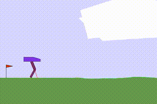

# PPO-Implementation

Welcome to my personal implementation of the Proximal Policy Optimization (PPO) algorithm! This repository is a **learning project** where I attempt to recreate and understand the workings of PPO, as introduced in the original paper [**Proximal Policy Optimization Algorithms**](https://arxiv.org/abs/1707.06347) by Schulman et al. While I’ve tried to make the code as clear and correct as possible, **please don't use this for actual training or production purposes**. Instead, refer to widely tested libraries like [Stable Baselines3 (SB3)](https://github.com/DLR-RM/stable-baselines3) if you need a reliable PPO implementation.

This project gave me insight into reinforcement learning, but it’s not intended for rigorous training. I hope it can serve as a reference for others learning about PPO.

## Examples of Trained Agents

Below are examples of agents I trained with this code.

### Lunar Lander V3 (continuous)


### Bipedal Walker V3


## Usage

Before following the instructions, make sure that you have git and poetry installed. 

1. **Clone this repository:**
```bash
git clone git@github.com:Kit115/PPO.git
```

2. **Install dependencies using poetry:**
```bash
poetry install
```

3. **Activate the virtual environment:**
```bash
poetry shell
```

4. **Run the main file:**
```bash
python main.py
```

## Current Limitations

**Supported Action Spaces**: Currently, this implementation only supports environments with continuous action spaces.

**Unsupported Features**:

+ Recurrent Policies: The implementation does not support recurrent neural networks (RNNs) or policies with memory.
+ Discrete Action Spaces: Environments with discrete action spaces are not compatible.
+ Advanced Features: Features like multi-agent support, custom network architectures, and advanced exploration strategies are not implemented.

This project focuses on the core PPO algorithm for continuous control tasks. Future updates may include support for additional features, but for now, the implementation remains simple to aid in learning and understanding the fundamentals.


## Acknowledgments

I would like to thank the authors of the following resources that have significantly influenced this project:

- **[OpenAI Spinning Up in Deep RL](https://spinningup.openai.com/en/latest/)**: This comprehensive resource provided foundational knowledge and inspiration for my PPO implementation.
- **[Stable Baselines3](https://github.com/DLR-RM/stable-baselines3)**: The SB3 library served as a valuable reference for code structure, implementation details, and best practices.
- **[37 Implementation Details of PPO](https://iclr-blog-track.github.io/2022/03/25/ppo-implementation-details/)**: This in-depth article clarified numerous subtle but important aspects of PPO implementation.
- **[What Matters for On-Policy Deep Actor-Critic Methods? A Large-Scale Study](https://arxiv.org/abs/2006.05990)**: This paper offered critical insights into the factors that impact the performance of on-policy methods like PPO.


